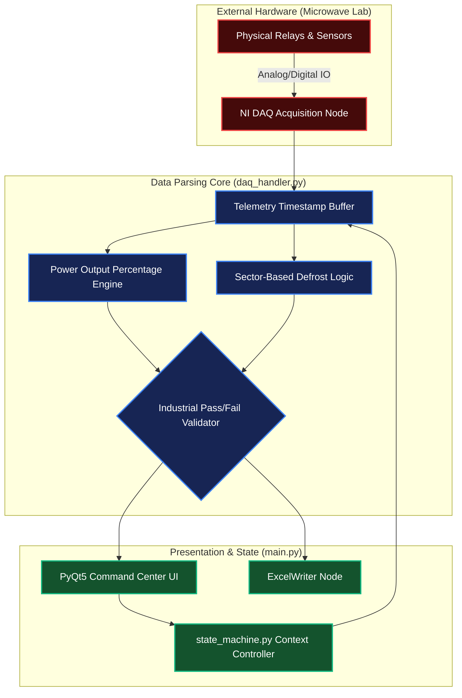
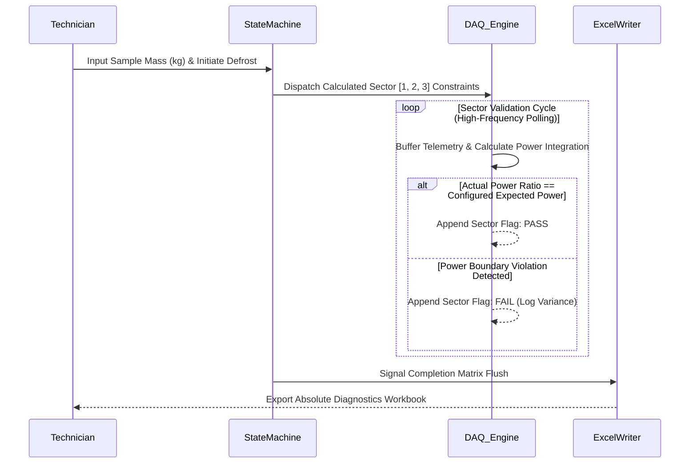

<div align="center">
  <h1>Enterprise Microwave QA Automation Framework</h1>
  <h3>Industrial Hardware-in-the-Loop (HIL) Testing & Telemetry Analysis</h3>

  <p>
    
    
    
    
    
    
  </p>
</div>

## Executive Summary
The **Microwave Automation Testing System** is an industrial-grade Python software infrastructure engineered to execute rigorous autonomous Quality Assurance (QA) on microwave oven hardware. Utilizing a native architecture bound directly to physical DAQ (Data Acquisition) hardware, the system dynamically ingests real-time, multi-channel telemetry—including Microwave, Grill, Lamp, Door Switch, and Buzzer signals—to enforce absolute operational compliance and safety standards.

By integrating complex deterministic State Machines and mathematically rigorous Sector-Based Defrost analytical logic, the platform completely automates Pass/Fail validation criteria and translates high-frequency raw signal data into comprehensive, enterprise-ready Excel diagnostic matrices.

---

## 1. Hardware-Software Operational Topology
The system abstracts physical hardware intricacies through a strictly partitioned codebase, ensuring UI responsiveness remains uncompromised during high-frequency DAQ polling sequences.



---

## 2. Core Architectural Components

### Presentation & UX
- `main.py`: The primary asynchronous controller bridging the user execution thread to the underlying hardware polling loops. It manages event logging, dynamic configuration of thresholds, and updates real-time `pyqtgraph` visual statistics without interface latency.
- `DefrostDialog`: A specialized computational UI class initializing user weight parameters to dynamically project and enforce rigorous chronological sector milestones.

### Acquisition & Analytics
- `daq_handler.py`: The computational nucleus. Connects via `nidaqmx` to orchestrate multi-channel parsing. It calculates strict power percentages bounded by configurable micro-windows and identifies critical industrial safety violations (e.g., catastrophic simultaneous MW+Grill signal overlaps, or Door-Open logic breaks).
- `config.py`: The centralized constants parameterization vault. Isolates device channel mappings, deterministic tolerance thresholds, sector definitions, and GUI theme directives strictly away from execution logic.

### Reporting & State Governance
- `excel_writer.py`: Programmatically interfaces with `openpyxl` to autonomously construct highly formatted Excel workbooks. It flushes raw arrays, statistical summaries, and sector-by-sector Pass/Fail matrices into immutable industrial documentation formats.
- `state_machine.py`: Enforces operational immutability. Maps transitional matrices (Idle, Running, Paused) to prevent chaotic execution cycles and hard-stops the hardware processes during safety interrupts like Child Lock engagements.

---

## 3. Sector-Based Defrost Algorithmic Execution
Due to the non-linear thermal dynamics of industrial microwave defrosting algorithms, the system divides temporal executions into three strict validation sectors.



---

## ⚙️ Environment Setup & System Deployment

To deploy the DAQ automation suite securely across laboratory environments:

**1. Virtual Execution Environment Initialization**
```bash
python -m venv .venv
# Activate environment (Windows)
.venv\Scripts\activate
```

**2. Satisfy Dependency Graphs**
```bash
pip install -r requirements.txt
```

**3. Hardware Calibration & Execution**
- Physically interface channels according to mappings strictly defined in `config.py`.
- Initialize the primary control application:
```bash
python main.py
```

### Engineered & Architected by Ziad Emad
*Establishing uncompromising industrial QA standards through deterministic software architecture.*
